# LrWatchPro - 儿童智能手表全栈解决方案

## 📌 项目概述
**LrWatchPro** 是一款完整的儿童智能手表解决方案，涵盖硬件通信、云端服务和管理平台的全栈实现。采用2025年最新技术栈开发，包含：
- **多协议服务器集群**（HTTP/TCP/推送）
- **跨平台移动端**（Android/iOS）
- **可视化管理系统**

> 🚀 *业余时间独立开发项目 | 行业专业级实现 | 无版权纠纷 | 技术持续更新*

---

## 🛠 技术架构

### 后端服务
| 组件 | 技术栈 | 特点 |
|------|--------|------|
| HTTP服务器 | Go + Gin + MySQL | 设备/用户管理、版本控制 |
| TCP长连接服务器 | Go + 自定义协议 | 实时定位/聊天数据传输 |
| 推送服务 | Go + WebSocket | 支持APNS/FCM/厂商通道 |
| 基础设施 | Redis + RabbitMQ | 高并发消息处理 |

### 移动端
- **Android**: Jetpack Compose + Kotlin
- **iOS**: SwiftUI + Swift

### 运维支持
- Docker容器化部署
- Linux生产环境验证
- 一键部署脚本

---

## ✨ 核心功能

### 移动端功能

  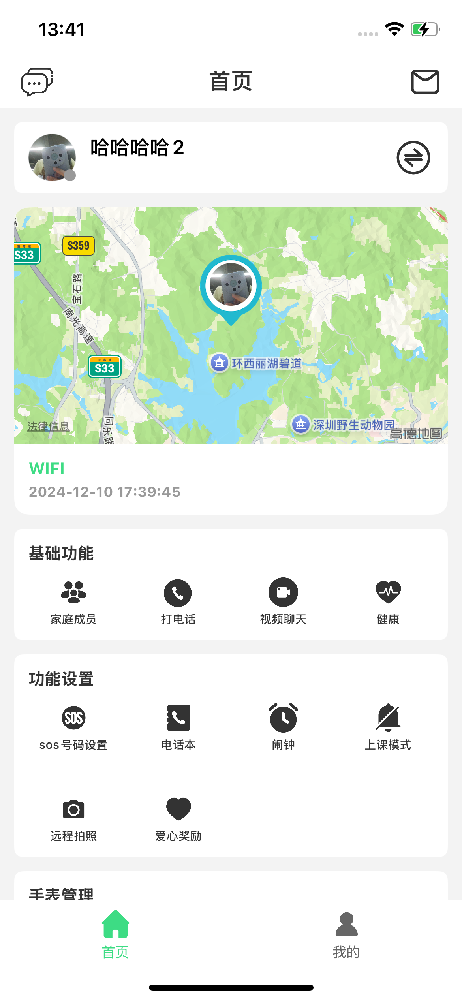
  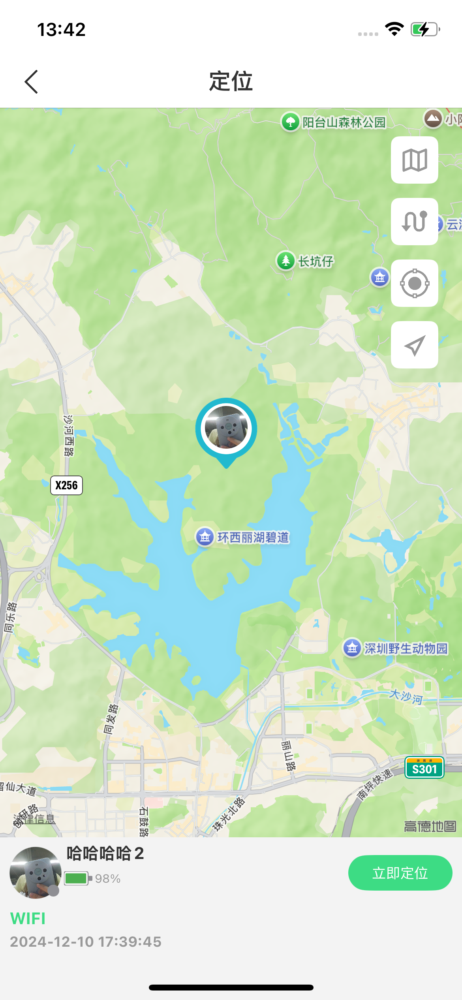
  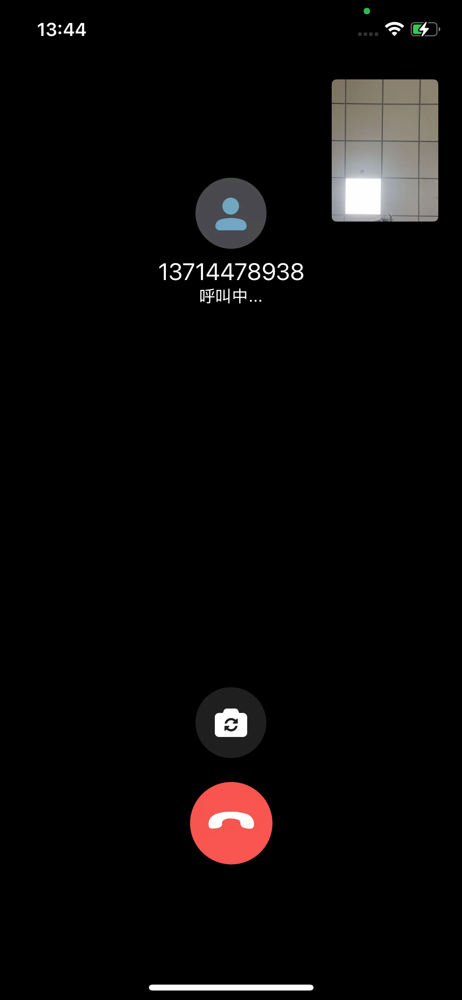
  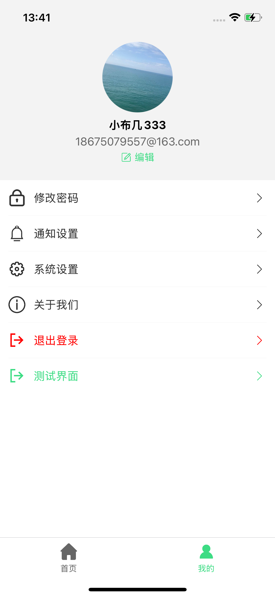
  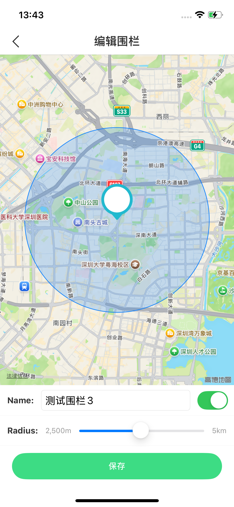
  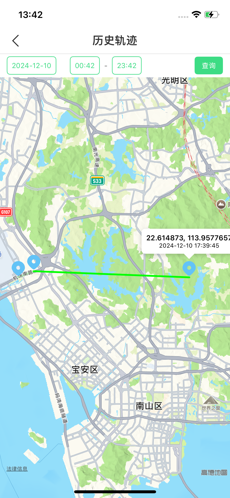
  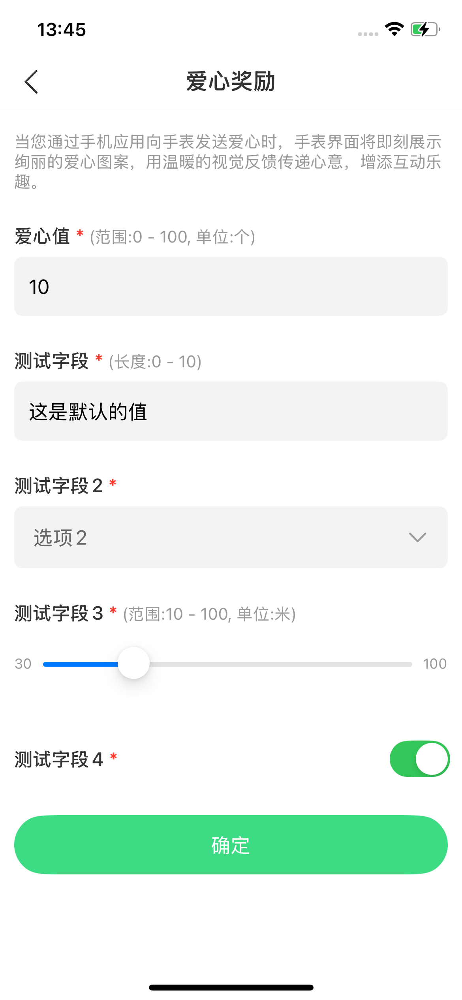
  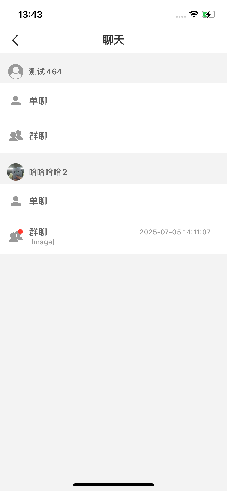
  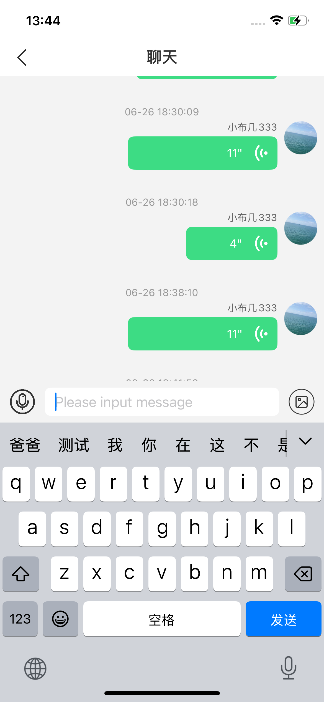
  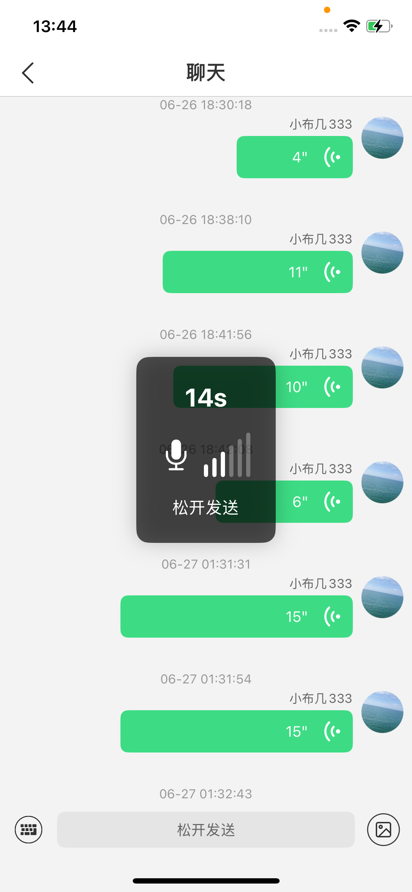
  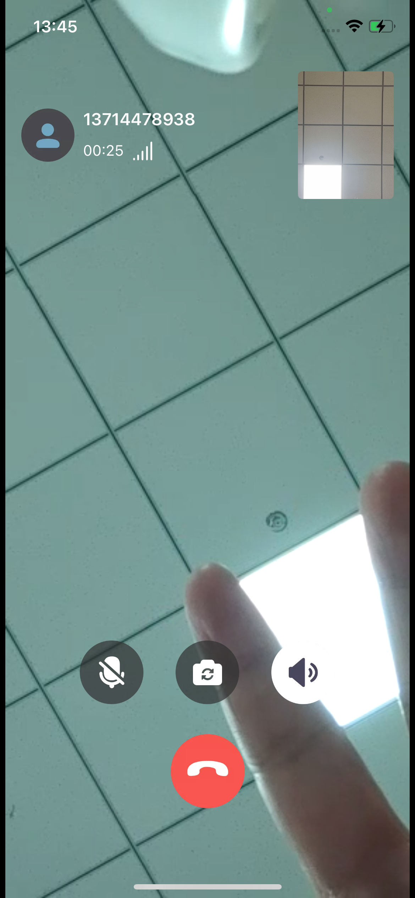

- 📍 实时定位与电子围栏
- 🎛️ 动态参数配置
- 📞 语音/视频通话
- 📨 即时通讯系统
- 🗺️ 运动轨迹追踪

### 管理系统

  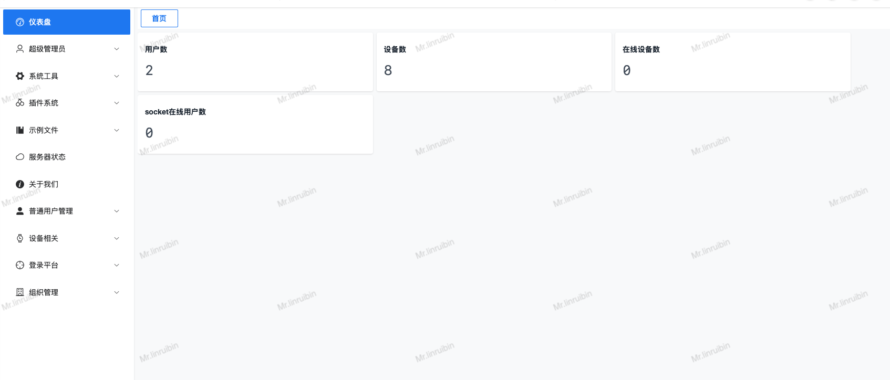
  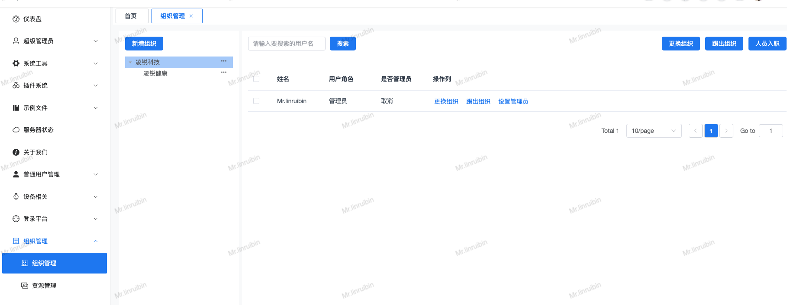
  

- 👥 多维度用户管理
- 🔔 设备状态监控
- 📊 数据统计分析
- ⚙️ 系统配置中心

---

## 💡 项目优势

1. **全自主开发**
   - 无第三方SDK依赖
   - 协议层完全可控
   - 极简架构低成本运营

2. **生产就绪**
   - 已完成基础功能闭环
   - 扩展接口完善
   - 经过压力测试验证

3. **商业价值**
   - 节省6-12个月开发周期
   - 可定制行业解决方案
   - 持续技术维护支持

---

## 🤝 合作方式

**源码授权** | **定制开发** | **技术咨询**

📱 联系微信: **18675079557**  
📧 备注: **LrWatchPro合作**

> 注：本项目为个人开发作品，可根据需求提供:
> - 完整源代码授权（含所有服务器+移动端）
> - 二次开发技术支持
> - 生产环境部署指导
> - 功能模块深度定制

---

## 🖼️ 功能截图预览

### 移动端功能展示
| 功能模块 | 界面示例 |
|---------|----------|
| **主界面** |  |
| **安全防护** |   |
| **通讯功能** |   |

### 管理后台展示
 
